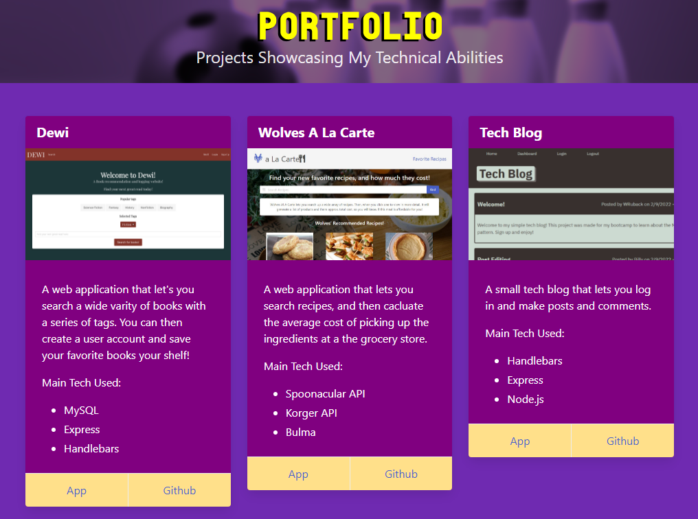
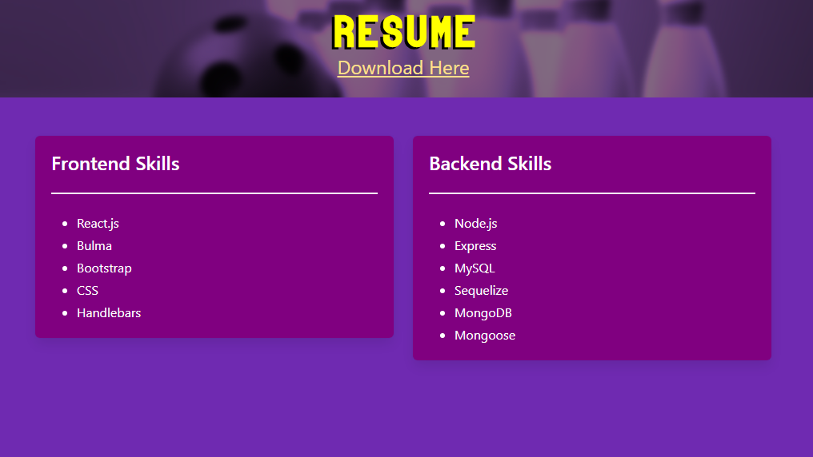
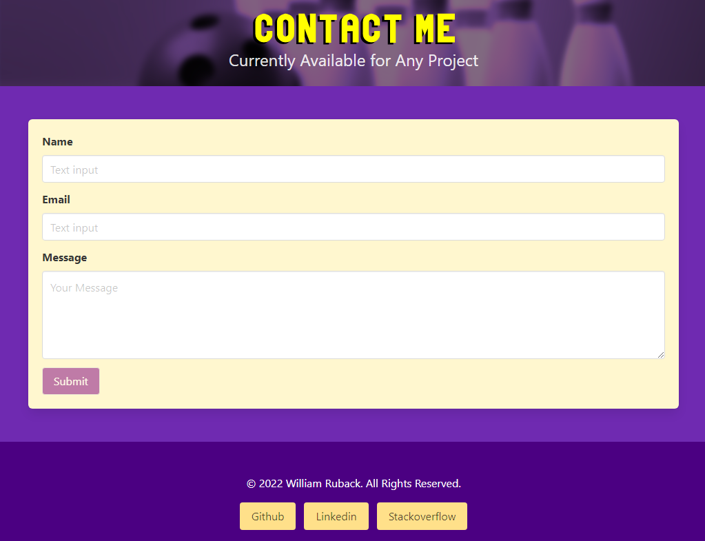

# React Portfolio

## Table of Contents

- [React Portfolio](#react-portfolio)
  - [Table of Contents](#table-of-contents)
  - [Description](#description)
  - [Deployment](#deployment)
  - [License](#license)
  - [Screenshots](#screenshots)
  - [Questions](#questions)

## Description

A portfolio website created using React.js and Bulma styling. It features multiple projects, a contact page, resume section, and links to other profiles. It also uses the gh-pages addon to deploy the site to github pages.

## Deployment

You can see the site deployed on Github pages [here](https://wruback.github.io/WR-react-portfolio/).

## License

This project is licensed under a [MIT license](https://opensource.org/licenses/MIT).

## Screenshots

## Questions

If you have any questions, please send them to [WRuback](https://github.com/WRuback) at wrubackdev@gmail.com with the heading "React Portfolio Question".
